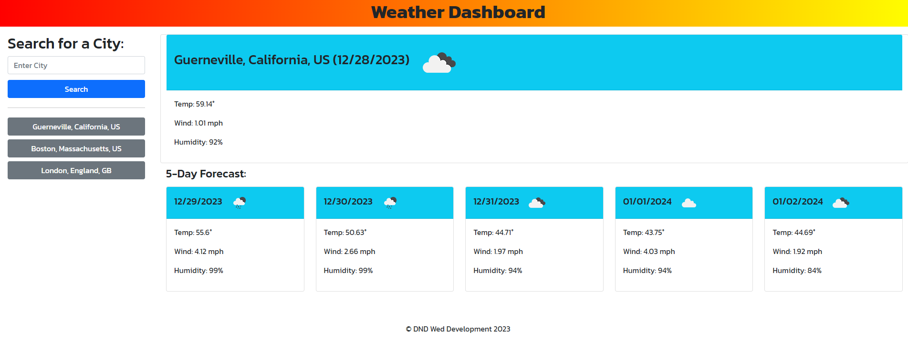

# weather-dashboard

## Description
The Weather Dashboard allows users to input any city in the world to find current weather conditions (temp, humidity and wind speed), as well as a 5 day future weather forecast. 
As a coding bootcamp student, this project allowed me to practice working with 3rd party APIs (openweathermap.org). I learned how to handle a response array and allow users to 
select the best match for their inquiry. I also learned how to destructure arrays and objects, practiced passing data between functions using parameters, and saving to and 
pulling from local storage.

## Usage
Navigate to: danidrury.github.io/weather-dashboard
Input any city into the search input box. You will be provided with up to 10 possible matches, select the city you want, then weather details for that city are displayed.

## Credits
OpenWeatherMap API

## License
MIT License